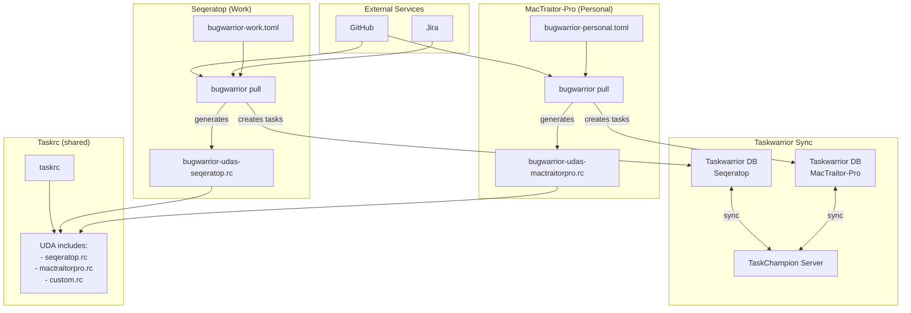

# Bugwarrior Configuration

Bugwarrior syncs tasks from external services (GitHub, Jira) into Taskwarrior.

## Architecture



## Key Concepts

### Per-Host Pull, Shared Sync

- **Pull is per-host**: Each machine runs `bugwarrior pull` with its own config and credentials
- **Sync is shared**: TaskChampion syncs tasks between all machines
- **UDAs are union**: Both hosts' UDA files are included so synced tasks have all field definitions

### Why Per-Host UDAs?

Tasks created on Seqeratop (with Jira fields) sync to MacTraitor-Pro. Without Jira UDAs defined on MacTraitor-Pro, taskwarrior would error on unknown fields. Including both UDA files ensures all machines understand all possible fields.

## Files

| File | Tracked | Purpose |
|------|---------|---------|
| `bugwarrior-work.toml` | Yes | Seqeratop config (Jira + GitHub) |
| `bugwarrior-personal.toml` | Yes | MacTraitor-Pro config (GitHub only) |
| `bugwarrior-udas-seqeratop.rc` | No | Auto-generated UDAs from work config |
| `bugwarrior-udas-mactraitorpro.rc` | No | Auto-generated UDAs from personal config |
| `bugwarrior-udas-custom.rc` | Yes | Manual UDAs (extra_fields, etc.) |

## Setup

### First-Time on New Machine

1. Create placeholder UDA files (breaks circular dep):
   ```bash
   touch ~/.config/dotfiles/config/taskwarrior/bugwarrior-udas-seqeratop.rc
   touch ~/.config/dotfiles/config/taskwarrior/bugwarrior-udas-mactraitorpro.rc
   ```

2. Set up credentials (see `bin/setup-bugwarrior-credentials`)

3. Generate UDAs for this host:
   ```bash
   # On Seqeratop:
   bugwarrior uda > ~/.config/dotfiles/config/taskwarrior/bugwarrior-udas-seqeratop.rc

   # On MacTraitor-Pro:
   bugwarrior uda > ~/.config/dotfiles/config/taskwarrior/bugwarrior-udas-mactraitorpro.rc
   ```

4. Test:
   ```bash
   bugwarrior pull --dry-run
   ```

### Adding a New Service

1. Add target to appropriate `.toml` config
2. Regenerate UDAs: `bugwarrior uda > ~/.config/dotfiles/config/taskwarrior/bugwarrior-udas-<host>.rc`
3. If using `extra_fields`, add UDA to `bugwarrior-udas-custom.rc`

## See Also

- [UDAS.md](UDAS.md) - Detailed UDA management docs
- [AGENTS.md](AGENTS.md) - Agent guidance for bugwarrior tasks
