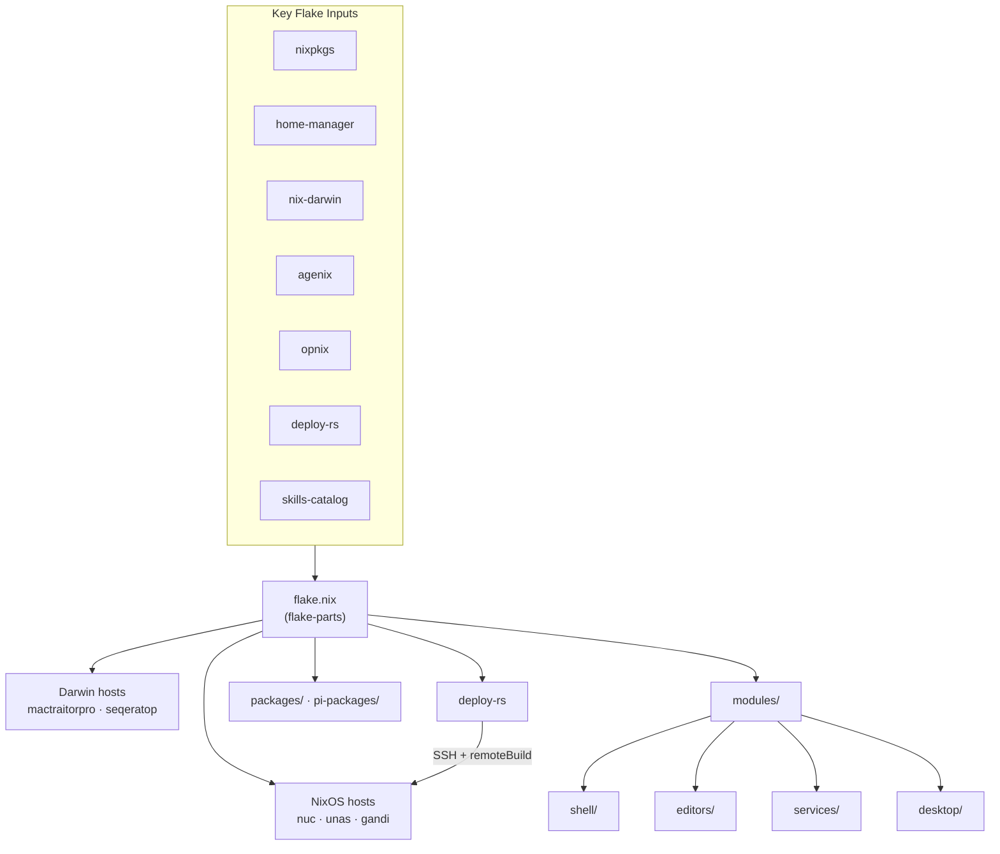

# Dotfiles Architecture

> A nix-darwin / NixOS dotfiles repository using flake-parts, home-manager, deploy-rs, and agenix.

## Architecture Diagram

See [`architecture.mermaid`](./architecture.mermaid) for the full visual, or view inline:



## Flake Structure

The repository is a single Nix flake (`flake.nix`) built with **flake-parts**. Key outputs:

| Output                 | Description                                                   |
| ---------------------- | ------------------------------------------------------------- |
| `darwinConfigurations` | macOS system configs (MacTraitor-Pro, Seqeratop)              |
| `nixosConfigurations`  | NixOS system configs (nuc, unas, gandi, meshify)              |
| `deploy.nodes`         | deploy-rs targets for remote deployment                       |
| `packages`             | Custom Nix derivations (dagster, zele, jut, dmux, …)          |
| `overlays`             | `pkgs.unstable` and `pkgs.my` (custom packages)               |
| `devShells`            | Development shells (`default` with linters, `agent` headless) |
| `checks`               | deploy-rs validation, zunit tests, HA assertions              |
| `templates`            | Starter configs (full, minimal)                               |

## Module System

All configuration lives under `modules/`, organized by domain:

```
modules/
├── shell/          # zsh, git, jj, tmux, 1password, ai, pi, ssh, direnv, claude
├── editors/        # emacs, vim, helix, VS Code, file associations
├── dev/            # node, python, rust, R, lua, nix, shell, nextflow
├── desktop/        # apps, browsers, terminals (ghostty), media, macos, gnome
│   ├── apps/       # raycast, openclaw, discord, mail
│   ├── term/       # ghostty, kitty, wezterm
│   └── macos/      # macOS-specific (homebrew, defaults)
├── services/       # hass, dagster, bugster, jellyfin, homepage, docker, tailscale, …
├── hardware/       # bluetooth, filesystem, audio
├── themes/         # alucard theme (stylix-based)
├── agenix/         # Secret declarations
├── options.nix     # Custom module options (modules.*)
├── darwin-base.nix # Shared Darwin defaults
└── nixos-base.nix  # Shared NixOS defaults
```

### How Modules Work

Each module declares options under `modules.<domain>.<name>` (e.g., `modules.shell.git.enable`). Host configs in `hosts/` set these options to compose the desired system.

The root `default.nix` imports all modules with **platform filtering** — NixOS-only modules (hardware, server services) are excluded on Darwin, and Darwin-only modules (homebrew casks) are excluded on NixOS.

### Config Files

Application dotfiles live in `config/` (40+ apps: ghostty, git, tmux, zsh, nvim, lazygit, agents, etc.). Modules wire them into the system via home-manager's `home.configFile` or `home.file`, which symlinks them from the Nix store to `~/.config/`.

**Config files are read-only at their target path.** Edit the source in `config/`, then rebuild.

## Host Configurations

### Darwin Hosts (aarch64-darwin)

| Host              | Machine              | User           | Notable                                                |
| ----------------- | -------------------- | -------------- | ------------------------------------------------------ |
| **mactraitorpro** | Personal MacBook Pro | `emiller`      | Full desktop: emacs, ghostty, homebrew casks, openclaw |
| **seqeratop**     | Work MacBook Pro     | `edmundmiller` | Similar to mactraitorpro + conda for bioinformatics    |

Darwin hosts are built with `nix-darwin` and configured inline in `flake.nix` (not via `lib/nixos.nix`).

### NixOS Hosts (x86_64-linux)

| Host        | Machine                 | User      | Notable                                                               |
| ----------- | ----------------------- | --------- | --------------------------------------------------------------------- |
| **nuc**     | Intel NUC (home server) | `emiller` | Home Assistant, Dagster, OpenClaw, Jellyfin, Homepage, Bugster, Gatus |
| **unas**    | NAS                     | `emiller` | ZFS, Syncthing, Time Machine backup, NFS exports                      |
| **gandi**   | Gandi VPS               | `emiller` | Minimal server: SSH, Syncthing, Tailscale                             |
| **meshify** | Desktop (inactive)      | —         | Legacy workstation config                                             |

NixOS hosts are built via `lib/nixos.nix` → `mkHost`, which adds opnix, the `openclaw-workspace` base/personal-default modules, and skills-catalog modules.

### Shared Host Configs

- `hosts/_home.nix` — Common home-manager settings for interactive machines
- `hosts/_server.nix` — Common server baseline (disko patterns, hardening)

## Secrets Management

### agenix (NixOS hosts)

Encrypted `.age` files in `hosts/nuc/secrets/`. Decrypted at activation time via host SSH keys. Used for:

- Service tokens (OpenClaw gateway, HA, Linear, Gemini API keys)
- User passwords
- Environment files for services (homepage, bugster, lubelogger)

### opnix (1Password integration)

Reads secrets from 1Password vaults at build/activation time via a service account token bootstrapped at `/etc/opnix-token`. Used on both Darwin and NixOS hosts for:

- Obsidian Sync credentials
- Agent API keys
- Xiaomi device tokens

### Relationship

agenix handles static server secrets (encrypted in git). opnix handles dynamic secrets that rotate in 1Password. Some services use both (e.g., NUC's OpenClaw uses agenix for gateway tokens and opnix for 1Password vault access).

## Deployment Topology

```
┌─────────────────────────────────────────────────────────────┐
│  Developer Machine (mactraitorpro / seqeratop)              │
│                                                             │
│  darwin-rebuild switch --flake .     (local rebuild)        │
│  deploy .#nuc                        (remote via SSH)       │
│  deploy .#unas                       (remote via SSH)       │
└──────────────┬──────────────────────────┬───────────────────┘
               │ SSH + remoteBuild        │ SSH + remoteBuild
               │ magic rollback           │ magic rollback
               ▼                          ▼
        ┌──────────────┐          ┌──────────────┐
        │     nuc      │          │     unas     │
        │  (services)  │          │    (NAS)     │
        └──────────────┘          └──────────────┘
```

**deploy-rs** provides:

- **Remote builds** — builds happen on the target machine (no cross-compilation)
- **Magic rollback** — auto-reverts if the new config breaks SSH connectivity
- SSH-based activation as root (`sshUser = "emiller"`, `user = "root"`)

Darwin hosts use local `darwin-rebuild switch` (deploy-rs wraps this but rollback isn't supported on macOS).

## Packages

### Nix Packages (`packages/`)

Custom derivations available as `pkgs.my.*` via the default overlay. ~40 packages including:

- **dagster** — Python data orchestrator with plugins
- **zele** — CLI tool (patched upstream)
- **jut** — Jujutsu workflow helpers
- **dmux** — tmux session manager
- **zunit** — Zsh unit test framework
- **tmux plugins** — smart-name, smooth-scroll, opencode-integrated

### TypeScript Packages (`pi-packages/`)

Bun workspace monorepo with Pi agent extensions:

- **pi-dcp**, **pi-qmd**, **pi-scurl** — agent tool extensions
- **pi-beads**, **pi-context-repo** — context and issue tracking
- **pi-bash-live-view**, **pi-non-interactive** — terminal interaction
- Shared `tsconfig.base.json`, tested via `pi-packages/tests/`

### Skills Catalog (`skills/`)

**Child flake** that pins remote agent skill repositories and exposes them as a home-manager module. Skills are symlinked to `~/.openclaw/workspace/skills/` on all hosts.

⚠️ After changing `skills/flake.nix` or `skills/flake.lock`, run `nix flake update skills-catalog` from the repo root to sync the parent lock file.

## External Service Dependencies

| Service              | Purpose                                           | Used By                                |
| -------------------- | ------------------------------------------------- | -------------------------------------- |
| **1Password**        | Secret management (opnix service account)         | All hosts                              |
| **GitHub**           | Source repo, deploy-rs target, agent integrations | All hosts                              |
| **Tailscale**        | Mesh VPN connecting all machines                  | nuc, unas, gandi                       |
| **healthchecks.io**  | Cron/service uptime monitoring                    | nuc (dagster, gatus, obsidian-sync, …) |
| **Linear**           | Issue tracking (OpenClaw agent bridge)            | nuc                                    |
| **Telegram**         | Bot interface for OpenClaw agents                 | nuc                                    |
| **Obsidian Sync**    | Headless vault synchronization                    | nuc                                    |
| **Cachix / Numtide** | Nix binary caches                                 | All hosts                              |

## Development Workflow

```bash
# Enter dev shell (linters + deploy-rs + pre-commit hooks)
nix develop

# Rebuild local Darwin system
sudo /run/current-system/sw/bin/darwin-rebuild switch --flake .

# Deploy to remote NixOS host
deploy .#nuc

# Run checks
nix flake check

# Format code
nix fmt
```

The `bin/hey` CLI wrapper provides shorthand for common operations.
