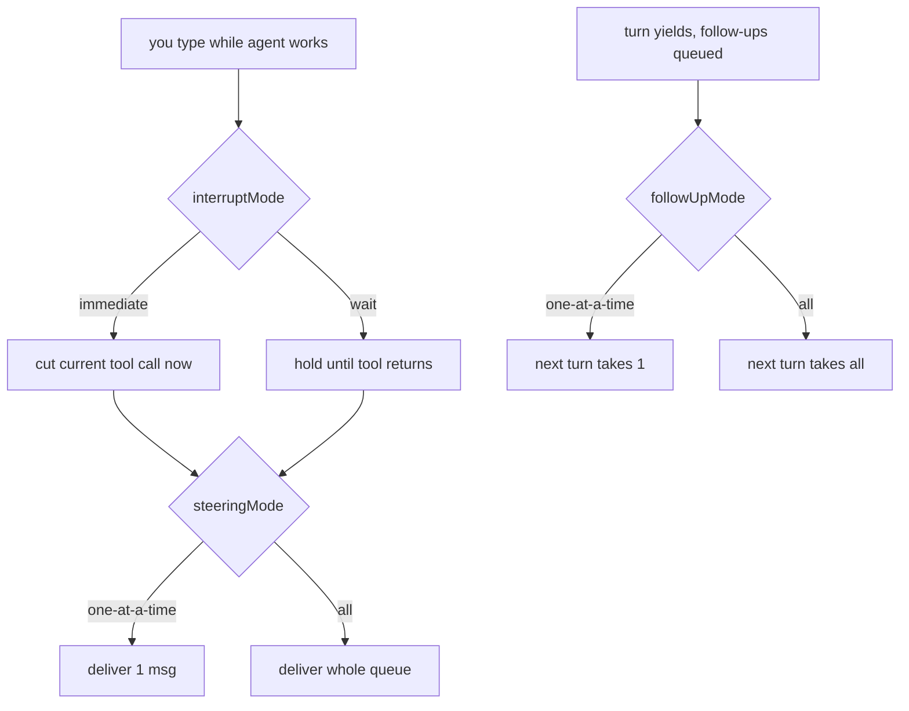

# OMP Message Queue Behavior

Three independent knobs govern what happens to messages you type while OMP is
working. They answer _different_ questions about the same queue, so they don't
collapse into one setting. Set via `omp config set <key> <value>` (OMP-owned
mutable state in `~/.omp/agent/config.yml`; not Nix-managed).

## The three knobs

| Key             | Question                                                  | Values                           | Applies to    |
| --------------- | --------------------------------------------------------- | -------------------------------- | ------------- |
| `interruptMode` | _When_ is a mid-session message delivered?                | `immediate` (default), `wait`    | steering only |
| `steeringMode`  | _How many_ mid-session messages drain per delivery?       | `one-at-a-time` (default), `all` | steering      |
| `followUpMode`  | _How many_ post-turn messages does the next turn pick up? | `one-at-a-time` (default), `all` | follow-ups    |

- **interruptMode** — `immediate` cuts the in-flight tool call short to deliver
  steering; `wait` defers until the tool returns.
- **steeringMode** — how the queue of steering messages typed _during_ a turn drains.
- **followUpMode** — how the queue of messages typed _after_ a turn yields drains.

## Flow



## Current config (2026-07-02)

`interruptMode: wait` + `steeringMode: all` + `followUpMode: all` — never
interrupt a running tool, but once delivery is safe, take everything queued at
once. Coherent batch-style config.

---

## Theme notes

### Light-mode mermaid label bug (fixed 2026-07-02)

**Symptom:** In light mode, mermaid diagram node/edge labels rendered
near-invisible (light-gray on light background); prose + arrows stayed readable.

**Cause:** `theme.light` was the generic `light` theme, whose node-label color
resolves to `lightGray #b0b0b0` — washed out on the light card background. The
terminal (ghostty) runs Catppuccin Latte in light mode, so the palettes were
also mismatched.

**Fix:** `theme.light = light-catppuccin` (matches ghostty's Latte background).
`theme.dark = titanium` left unchanged — bug only reproduced in light mode.

**Fallback if labels still wash out:** set `tui.renderMermaid: false` — the raw
` ```mermaid ` fenced block then prints in normal prose color (always
readable, no box-art).

**Upstream:** the default `light` theme shipping invisible mermaid labels
(`#b0b0b0`) is an accessibility bug worth reporting to `can1357`
(github.com/can1357/oh-my-pi).

### Light theme catalog

omp ships ~40 light themes (set `theme.light` to any of these ids):
`light-arctic`, `light-aurora-day`, `light-canyon`, `light-catppuccin`,
`light-cirrus`, `light-coral`, `light-cyberpunk`, `light-dawn`, `light-dunes`,
`light-eucalyptus`, `light-forest`, `light-frost`, `light-github`,
`light-glacier`, `light-gruvbox`, `light-haze`, `light-honeycomb`,
`light-lagoon`, `light-lavender`, `light-meadow`, `light-mint`,
`light-monochrome`, `light-ocean`, `light-one`, `light-opal`, `light-orchard`,
`light-paper`, `light-poimandres`, `light-prism`, `light-retro`, `light-sand`,
`light-savanna`, `light-solarized`, `light-soleil`, `light-sunset`,
`light-synthwave`, `light-tokyo-night`, `light-wetland`, `light-zenith`, plus
the neutral `light`. (`omp config set theme.light <id>` — no validation, so
spelling matters.)

### TODO

- **Align Herdr theme with OMP.** OMP is now `theme.dark: titanium` /
  `theme.light: light-catppuccin`; revisit Herdr's palette to match.
