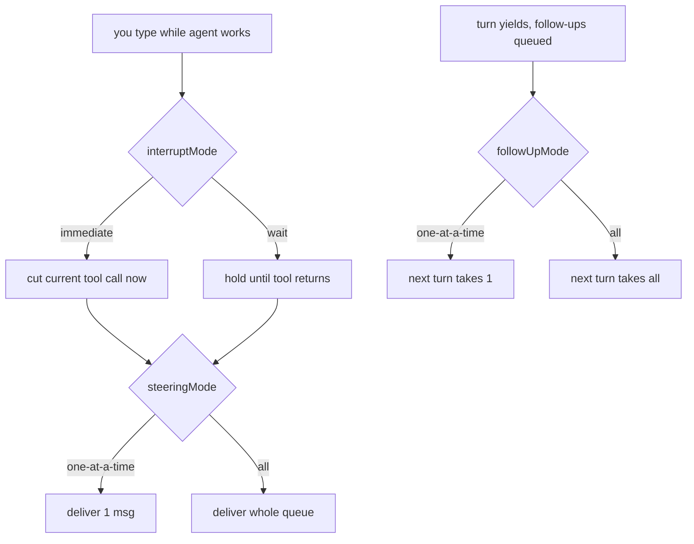

# OMP Message Queue Behavior

Three independent knobs govern what happens to messages you type while OMP is
working. They answer _different_ questions about the same queue, so they don't
collapse into one setting. Set in `config/omp/config.yml`; the OMP module renders the Nix-managed
`~/.omp/agent/config.yml` from that source plus host overlays.

## The three knobs

| Key             | Question                                                  | Values                           | Applies to    |
| --------------- | --------------------------------------------------------- | -------------------------------- | ------------- |
| `interruptMode` | _When_ is a mid-session message delivered?                | `immediate` (default), `wait`    | steering only |
| `steeringMode`  | _How many_ mid-session messages drain per delivery?       | `one-at-a-time` (default), `all` | steering      |
| `followUpMode`  | _How many_ post-turn messages does the next turn pick up? | `one-at-a-time` (default), `all` | follow-ups    |

- **interruptMode** — `immediate` cuts the in-flight tool call short to deliver
  steering; `wait` defers until the tool returns.
- **steeringMode** — how the queue of steering messages typed _during_ a turn drains.
- **followUpMode** — how the queue of messages typed _after_ a turn yields drains.

## Flow



## Current config (2026-07-08)

`interruptMode: wait` + `steeringMode: all` + `followUpMode: one-at-a-time` —
never interrupt a running tool; drain steering in batches once safe, then handle
post-turn follow-ups one at a time.

## Model roles (2026-07-10)

```
default xai-oauth/grok-composer-2.5-fast       # shared default; hosts may override
smol    xai-oauth/grok-composer-2.5-fast       # shared fast/mechanical slot
slow    openai-codex/gpt-5.6-sol:high          # heavier direct-sub reasoning
plan    vibeproxy/claude-opus-4-8:high         # strong planning via VibeProxy
commit  xai-oauth/grok-composer-2.5-fast       # falls back through smol
```

Direct-login providers (Codex on ChatGPT sub, xai-oauth) beat kilo credits for
the same model. VibeProxy is used where it adds a distinct role (`plan` on
Claude Opus 4.8); kilo/Claude remains only a fallback. There is no separate
"fast" role — `smol` is the fast slot.

### Per-host overrides

Shared role defaults live in `config/omp/config.yml`. Host auth/quota differences
belong in `modules.agents.omp.modelRoles`, which is rendered into the Nix-managed
config at activation. `modules.agents.omp.smolModel` also injects `PI_SMOL_MODEL`
for the smol/commit fast path. Precedence: `--smol` flag > `PI_SMOL_MODEL` env >
rendered `config.yml`.

- **mactraitorpro**: default `xai-oauth/grok-4.5`; smol `cursor/composer-2.5`.
- **seqeratop**: smol `cursor/composer-2.5`; default `openai-codex/gpt-5.6-sol:low`.
- **fallbacks**: shared `slow` falls back Sol → Terra → Luna; mactraitorpro
  default falls back to GLM only, while its `plan`/`slow` paths include
  `xai-oauth/grok-4.5:high` before GLM.

**Gotcha — Codex catalog lies.** `omp models openai-codex` can list unsupported
ids; smoke-test every new id before trusting it. Verified GPT-5.6 ids:
`gpt-5.6-sol`, `gpt-5.6-terra`, `gpt-5.6-luna`.

---

## Theme notes

### Light-mode contrast fixes

**Mermaid labels (fixed 2026-07-02):** the generic `light` theme used
`lightGray #b0b0b0` for node labels, washed out on light cards. Use a
Catppuccin-based light theme instead; keep `tui.renderMermaid` enabled.

**Markdown/status text (fixed 2026-07-04):** upstream `light-catppuccin`
keeps several decorative tokens too pale on Ghostty Latte (inline code,
link URLs, list bullets, dim/tool output, and some status-line accents).
Dotfiles installs a custom `light-catppuccin-readable` theme under
`~/.omp/agent/themes/` and sets `theme.light` to that id. It preserves the
Latte base/background while darkening low-contrast foreground tokens.

### Light theme catalog

omp ships ~40 light themes (set `theme.light` to any of these ids):
`light-arctic`, `light-aurora-day`, `light-canyon`, `light-catppuccin`,
`light-cirrus`, `light-coral`, `light-cyberpunk`, `light-dawn`, `light-dunes`,
`light-eucalyptus`, `light-forest`, `light-frost`, `light-github`,
`light-glacier`, `light-gruvbox`, `light-haze`, `light-honeycomb`,
`light-lagoon`, `light-lavender`, `light-meadow`, `light-mint`,
`light-monochrome`, `light-ocean`, `light-one`, `light-opal`, `light-orchard`,
`light-paper`, `light-poimandres`, `light-prism`, `light-retro`, `light-sand`,
`light-savanna`, `light-solarized`, `light-soleil`, `light-sunset`,
`light-synthwave`, `light-tokyo-night`, `light-wetland`, `light-zenith`, plus
the neutral `light`. (`omp config set theme.light <id>` — no validation, so
spelling matters.)

### Herdr alignment (done 2026-07-02)

OMP now matches Herdr and ghostty on Catppuccin, both modes:

- `theme.dark = dark-catppuccin` (Mocha — `base #1e1e2e` / `text #cdd6f4`).
  Matches Herdr's hunk plugin (`catppuccin-mocha`) and ghostty dark.
- `theme.light = light-catppuccin-readable` (custom Latte variant). Matches
  Ghostty/Herdr Latte backgrounds while raising light-mode text contrast.

Herdr's own UI theme is `name = "terminal"` (inherits the terminal palette),
and its dev-layout maps macOS dark→mocha / light→latte
(`config/herdr/plugins/dotfiles-dev-layout/`).

### Seqera brand themes (added 2026-07-04)

`config/omp/themes/{dark,light}-seqera.json` map the Seqera brand palette
(same source as `config/themes/seqera-dark.yaml` and the `SeqeraDark`/
`SeqeraLight` ghostty themes) onto omp's 67 theme fields. Signature accent is
Seqera teal `#31c9ac`; dark bg is the deep purple `#201637`. Light-mode brand
accents are darkened for contrast on white, mirroring `light-catppuccin-readable`.

All three themes install to `~/.omp/agent/themes/` on every omp host — only
activation is per-host. `config.yml` is shared, and omp has **no** theme env var
or flag, so `modules.agents.omp.themeDark` / `themeLight` overlay just the
`theme.dark` / `theme.light` keys onto the shared file at build time via `yq`
(null = keep the id shipped in `config.yml`). seqeratop sets `dark-seqera` /
`light-seqera` to match its stylix + ghostty + herdr Seqera branding;
mactraitorpro keeps the shared Catppuccin default. Precedence for the theme id
mirrors any config key: the build-time overlay wins because it rewrites the
sourced file.

---

## VibeProxy provider (added 2026-07-06, seqeratop)

[VibeProxy](https://github.com/automazeio/vibeproxy) is a macOS menu-bar app
(built on CLIProxyAPIPlus) that fronts your Claude Code / ChatGPT / Gemini /
Copilot / GLM **subscriptions** as a local OpenAI- and Anthropic-compatible
server on **port 8317** — no API keys, OAuth handled in the app's GUI.

`modules.agents.omp.vibeproxy.enable` installs `config/omp/models.yml` to
`~/.omp/agent/models.yml`, registering a `vibeproxy` provider
(`baseUrl: http://localhost:8317/v1`, `api: openai-completions`, `auth: none`).
The app itself is the `vibeproxy` homebrew cask on the host. Only seqeratop
enables it.

**Gotchas.**

- **No auto-discovery for custom providers** — `models.yml` must list ids
  explicitly (unlike built-in providers, `omp models refresh` won't populate
  them). Curated subset of `curl localhost:8317/v1/models`; add more there.
- **Mostly additive** — direct Codex/xai/Cursor logins carry default/smol/slow, while
  `plan` uses `vibeproxy/claude-opus-4-8:high`. Select other proxied models
  with `--model vibeproxy/<id>` or Ctrl+P cycling.
- **The app must be running** (menu bar → Running) and the relevant provider
  authed, or `vibeproxy/*` calls hit a dead port. Verified round-trip:
  `omp -p --no-session --no-tools --model vibeproxy/claude-opus-4-8 "say ok"`.
- **Cask vs. manual install** — if the app is already in `/Applications` from a
  manual download, `brew`/`hey re` may refuse to overwrite it; run
  `brew install --cask vibeproxy --adopt` once so homebrew adopts it.
