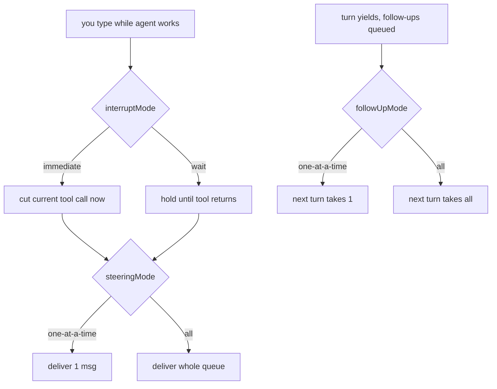

# OMP Message Queue Behavior

Three independent knobs govern what happens to messages you type while OMP is
working. They answer _different_ questions about the same queue, so they don't
collapse into one setting. Set via `omp config set <key> <value>` (OMP-owned
mutable state in `~/.omp/agent/config.yml`; not Nix-managed).

## The three knobs

| Key             | Question                                                  | Values                           | Applies to    |
| --------------- | --------------------------------------------------------- | -------------------------------- | ------------- |
| `interruptMode` | _When_ is a mid-session message delivered?                | `immediate` (default), `wait`    | steering only |
| `steeringMode`  | _How many_ mid-session messages drain per delivery?       | `one-at-a-time` (default), `all` | steering      |
| `followUpMode`  | _How many_ post-turn messages does the next turn pick up? | `one-at-a-time` (default), `all` | follow-ups    |

- **interruptMode** — `immediate` cuts the in-flight tool call short to deliver
  steering; `wait` defers until the tool returns.
- **steeringMode** — how the queue of steering messages typed _during_ a turn drains.
- **followUpMode** — how the queue of messages typed _after_ a turn yields drains.

## Flow

## Current config (2026-07-02)

`interruptMode: wait` + `steeringMode: all` + `followUpMode: all` — never
interrupt a running tool, but once delivery is safe, take everything queued at
once. Coherent batch-style config.

---

## TODO

- **Fix OMP + Herdr theme.** OMP is currently on `theme.dark: titanium` /
  `theme.light: light`; revisit the palette and align it with Herdr's theme.
